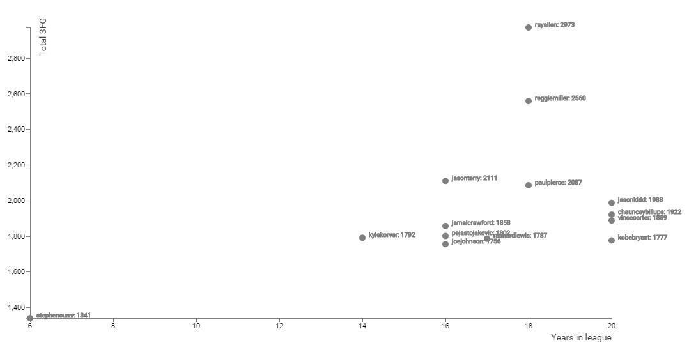
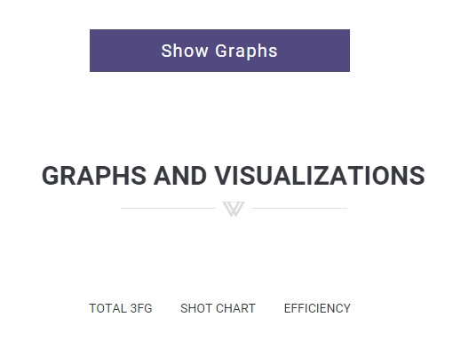
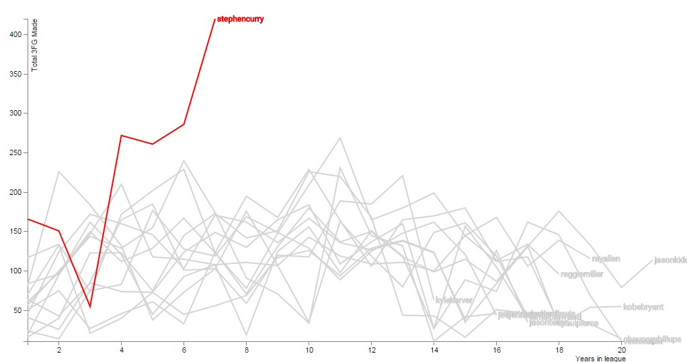
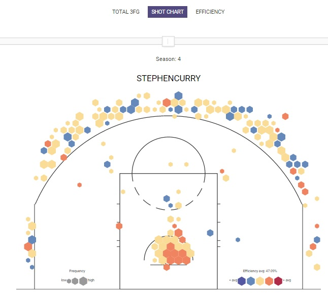

# Shooting Comparisor - Curry

## 1 - Introductie

Sinds dat Steph Curry terug is gekomen van zijn meerdere blessures verbreekt hij allemaal records binnen de NBA (National Basketball Association). Door velen wordt hij gezien als de nieuwe beste schutter aller tijden. Door zijn statistieken tegen andere legendarische schutters uit te zetten kan er pas objectief gekeken worden naar wat voor een goede schutter hij wel niet is.

Allereerst worden de top 14 3-punt schutters tegen elkaar uitgezet op een scatterplot. Via een selectie op de scatterplot kunnen spelers geselecteerd worden. De resterende grafieken zijn onder de scatterplot te vinden en komen tevoorschijn wanneer men op de knop "Show Graphs" klikt. Hier worden 3 grafieken weergeven waar de gebruiker conclusies uit kan halen.

## 2 - Doel

Het doel van deze pagina is om daadwerkeljk een conclusie te kunnen trekken of Steph Curry dit seizoen, en voorgaande seizoen zodanig goed bezig is dat hij als een van de beste schutters gezien kan worden. En daarbij of hij op pad is om de beste schutter ooit te worden. Vervolgens is het mogelijk andere top 3 punt schutters tegen elkaar op te zetten en met elkaar te vergelijken. Zo is de pagina niet alleen een tool om te zien hoe goed Curry bezig is, maar ook om vorige schutters te vergelijken.

## 3 - Screenshots

## Made by Bart Quaink - 11121424 - Free Use
