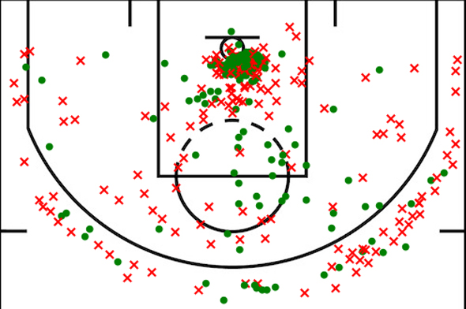
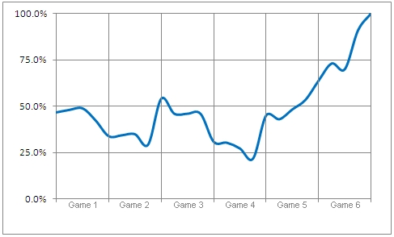
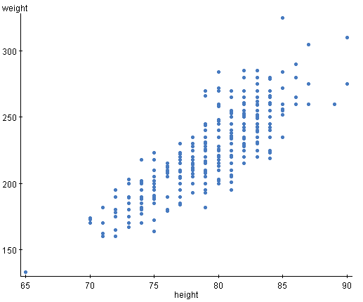

# Project - 3 point legend Steph Curry

# 1 - Introductie, features, probleemstelling

Sinds dat Steph Curry terug is gekomen van zijn meerdere blessures zet hij allemaal records binnen de NBA (National Basketball Association). Door velen wordt hij gezien als de nieuwe beste schutter aller tijden. Door zijn statistieken tegen andere legendes zoals Larry Bird, Reggie Miller of Ray Allen uit te zetten kan er pas objectief gekeken worden naar wat voor een goede schutter hij wel niet is. 

Door middel van verschillende manieren van het representeren van data te gebruiken kunnen deze spelers tegen elkaar afgewogen worden. Denk hierbij aan scatterplots met het totaal aantal gemaakte 3FG (3 point field goals) per wedstrijd van een seizoen, linegraphs waarin het totale aantal 3 punters over de loop van een carriëre uitgezet worden of shotcharts van de 3FG% op een gebied op het veld. Door deze uit te zetten in een interactieve visualisatie kunnen deze spelers snel en gemakkelijk vergeleken worden. 

Het probleem wat dus opgelost gaat worden is een feitelijke conclusie geven aan wie nu precies in zijn looptijd de beste 3-punt schutter is. 

Een shotchart, een groen vinkje staat voor een gemaakt schot en een rood kruisje voor een gemiste poging.

Een linegraph.

Een scatterplot.

# 2 - Schets webpagina

# 3 - Data sets

Via www.basketball-reference.com zijn alle statistieken te vinden over al deze schutters. De data is te downloaden in verschillende data formaten, ik zal voor csv kiezen en hiervan gebruik maken. Via een python script zal deze data omgezet worden naar een JSON bestand, waardoor ik de data interactief kan maken via javascript en HTML.

# 4 - Onderdelen

De onderdelen van deze visualisatie kunnen apart bekeken worden, de scatterplots, lijngrafieken en shotcharts kunnen op zich bekeken worden en per deze kunnen er verschillende conclusies getrokken worden. Pas wanneer de grafieken met elkaar vergeleken worden kan er naar een groter geheel gekeken worden; wie nu daadwerkelijk de titel verdiend om beste 3-punt schutter genoemd te worden. Interactiviteit binnen de grafieken is eigenschap, door een selectie te maken onder deze schutters kan de grafiek gefocused worden op een specifieke speler om van deze de 3-punt loopbaan te bekijken.

# 5 - Programma's

Bij het visualiseren van de data zal gebruik gemaakt worden van de D3 javascript library. Door middel van D3 kan er de gewenste interactiviteit gecreëerd worden. Het opschonen van de site over het algemeen zal via CSS gedaan worden. Zo zal er een toelichting bij elke speler gegeven worden. Echter, de visualisaties zullen alleen met D3 en javascript gemaakt worden.

# 6 - Problemen

Tijdens het creëeren en gebruik van deze visualisaties kunnen enkele problemen voorkomen. Ten eerste tijdens de creatie. Uit ervaring met het werken van D3 kan ik zeggen dat het lastig is precies het gewenste resultaat te krijgen, de interactiviteit kan wegens simpele fouten niet optimaal werken. Het visualiseren moet volgens bepaalde standaarden zijn, veel tijdens Data Processing geleerd. Natuurlijk is het vaak een mening over wat precies de optimale manier is om een boodschap over te brengen, niet iedereen heeft hier het beste oog voor, inclusief ik. Door middel van de kritiek momenten kan dit probleem verholpen worden, veel mensen die een oog op een visualisatie hebben helpt hier de optimale manier van design voor te kiezen.

Ten tweede, het gebruik van de webpagina. De gebruiker kan enkele problemen tegemoetkomen. Zo kan de interactie niet optimaal werken, kunnen enkele delen van de pagina niet goed verschijnen of nog erger, de gebruiker kan niet duidelijk de relatie tussen de visualisaties concluderen. De grafieken moeten in goed verband met elkaar staan en de gebruiker moet direct weten waar de grafieken over gaan en wat precies de boodschap is. Als alle visualisaties werken is het dus van belang een duidelijke toelichting te schrijven en de grafieken in een logische volgorde te plaatsen. De interactie tussen de grafieken moet duidelijk zijn, niet alleen hoe het werkt maar ook waarom er precies een interactie is.

# 7- Vergelijkbare projecten

Er zijn niet veel vergelijkbare projecten, doordat er zoveel data te vinden is in de NBA zijn er ontzettend veel verschillende visualisaties te vinden, en daardoor ook veel verschillende. Hier zijn wel enkele die het idee redelijk overbrengen.

http://asbcllc.com/blog/2014/november/big_data_exploration_in_r/unscaled/

https://i.imgur.com/MxXTCr4.jpg

En de zeer uitgebreide, prachtige
http://peterbeshai.com/buckets/app/#/playerView/201935_2015
